# FacePass - Your face-protected password vault
<a href = "https://drive.google.com/file/d/1kSHhKwFmTnzDdMb5khjn3wFIvUCpu3PH/view?usp=sharing" >APK Download Link</a>

## About The Project:
Today people have many credentials, bank cards, and important notes that they can't remember the details of. They can't write the credentials anywhere as it is a threat to the security of the credentials. With FacePass, users can keep their credentials safe as it requires face recognition and authentication. It also asks for the password during the login after face authentication, making it highly secure.
### Salient Features:
* User authentication using Face ID via Tensorflow Lite.
* Adding bank cards and websites login credentials.
* Storing important notes.
* The data is stored on the cloud to access from any device.
 
### Stack:
* Flutter:
  
  Flutter is an open source framework to create high quality, high performance mobile applications across mobile operating systems - Android and iOS.
* Tensorflow lite:
  
  TensorFlow Lite is an open source deep learning framework for on-device inference.

* Flutter + Tensrorflow lite = tflite_flutter package:
  
  TensorFlow Lite plugin provides a dart API for accessing TensorFlow Lite interpreter and performing inference. It binds to TensorFlow Lite C API using dart:ffi.

### Flutter packages/dependencies:
* tflite_flutter
* camera
* google_ml_kit
* image
* get_it
* sqflite
* tflite
* flutter_speed_dial
* fluttertoast
* firebase_core
* firebase_auth
* cloud_firestore
* flutter_launcher_icons

## Getting Started:
I have made this project open source so that others can access and contribute to the development of this application.
To install and run the project on your local system, follow the setup:
### Setup:
1- Clone the repository:

``` git clone https://github.com/srockstech/face_pass.git ```
 
2- Open the folder:
```cd face_pass```
 
3- Install dependencies:
```flutter pub get```
 
4- Run on device (Check if a device is connected or any virtual device running):
```flutter run```

 
 
## Navigating Through The App:
### Login/ Signup:
* First signup through face detection and enter name and password.
* Login to the app through face recognition and authentication and enter the password.

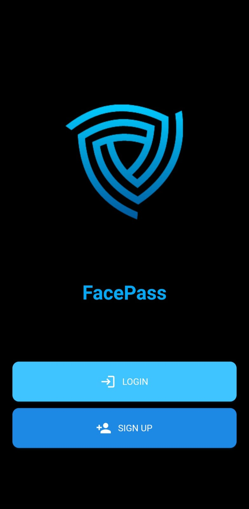
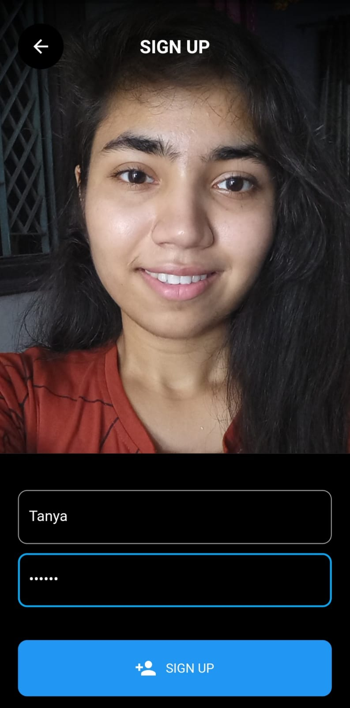
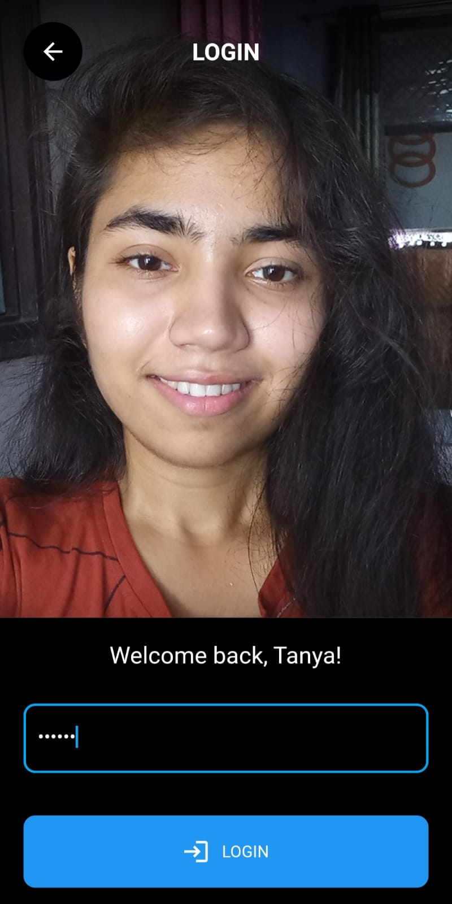

### Home Page:
* The Home page has a drawer and an add button. An user can add their important notes, website and bank card details directly by clicking on the floating add button.
* The drawer has the options of Bank Cards, Websites, Notes and Logout.

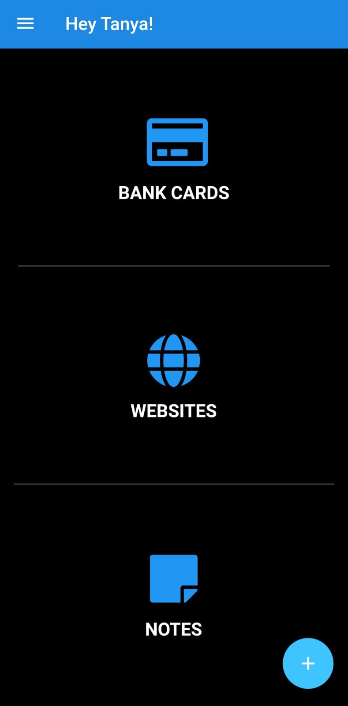
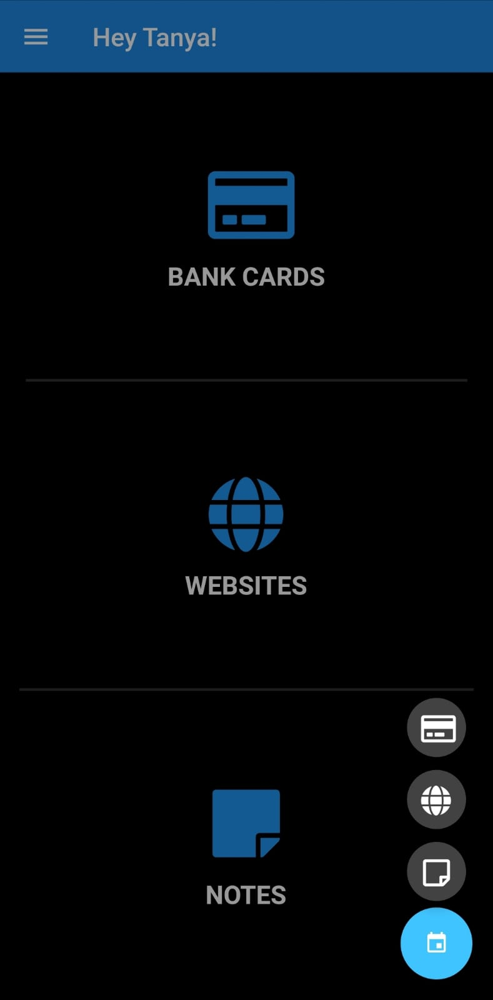
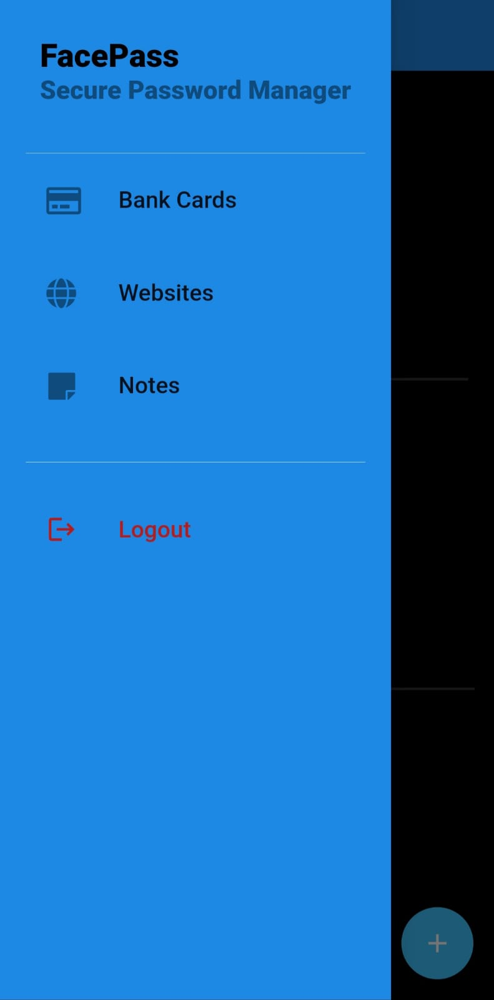

### Bank Cards:
* The 'Bank Cards' option in the drawer is the place where an user can check all the saved cards.
* It also has a floating add button through which an user can add details of other cards.
  
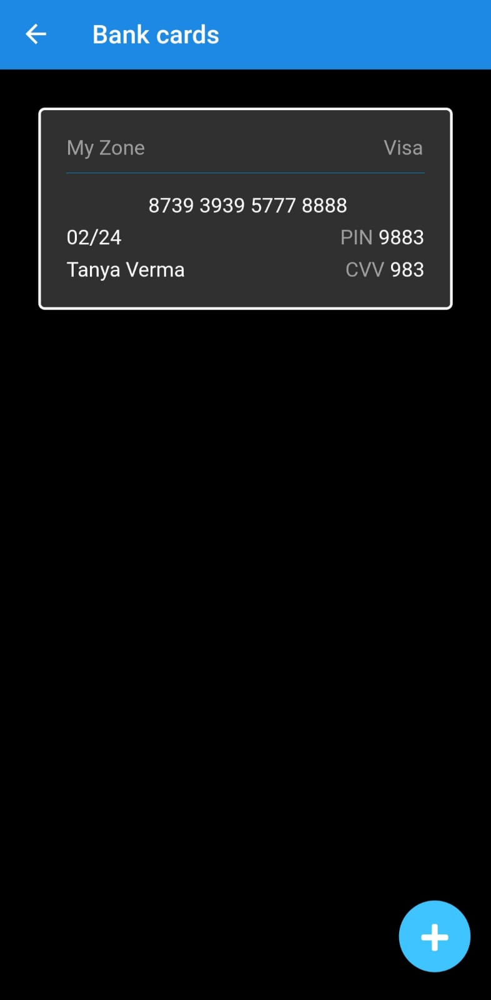
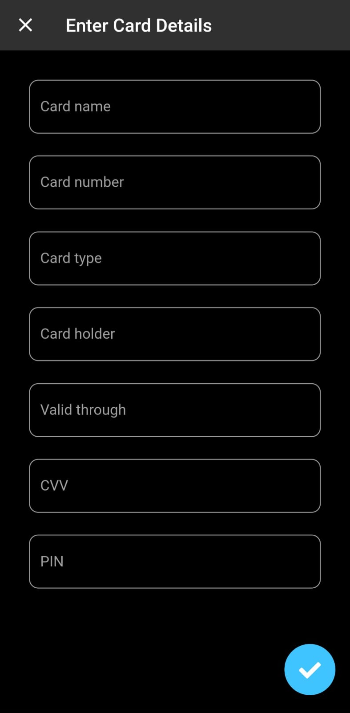

### Websites:
* The 'Websites' option in the drawer is the place where an user can check all the credentials of different websites saved by them.
* It also has a floating add button through which an user can add credentials of other websites.


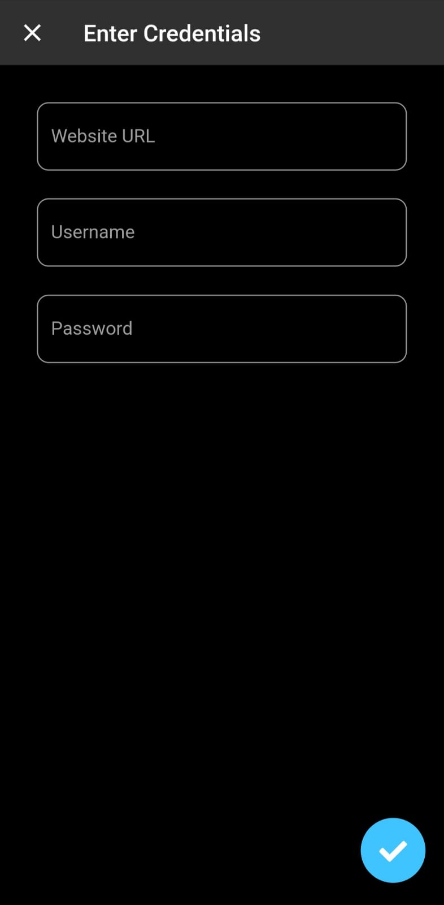

### Notes:
* The 'Notes' option in the drawer is the place where a user can check all the saved notes.
* It also has a floating add button through which a user can add new notes.

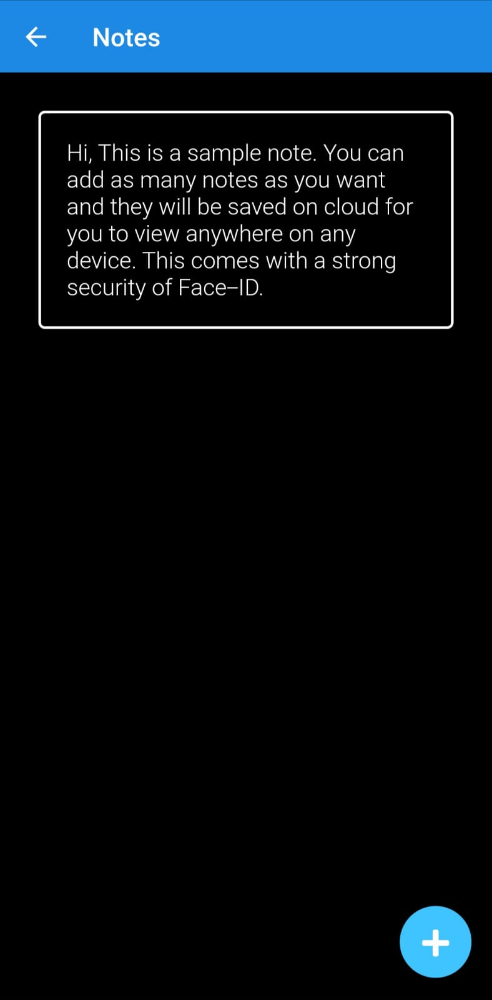


### Logout:
* The 'Logout' option in the drawer logs out the user.

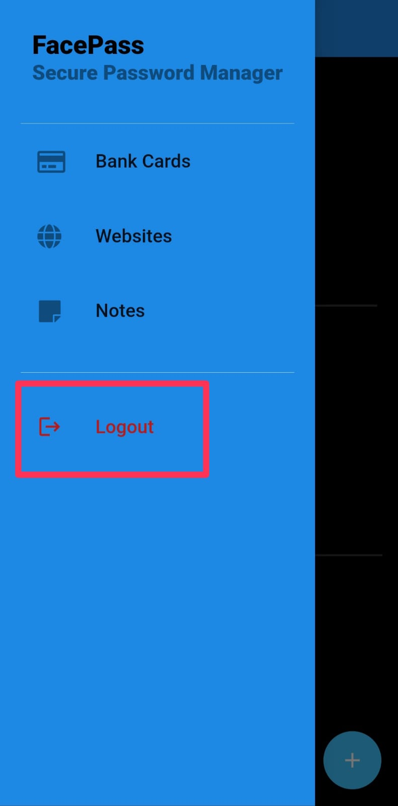
 
 

